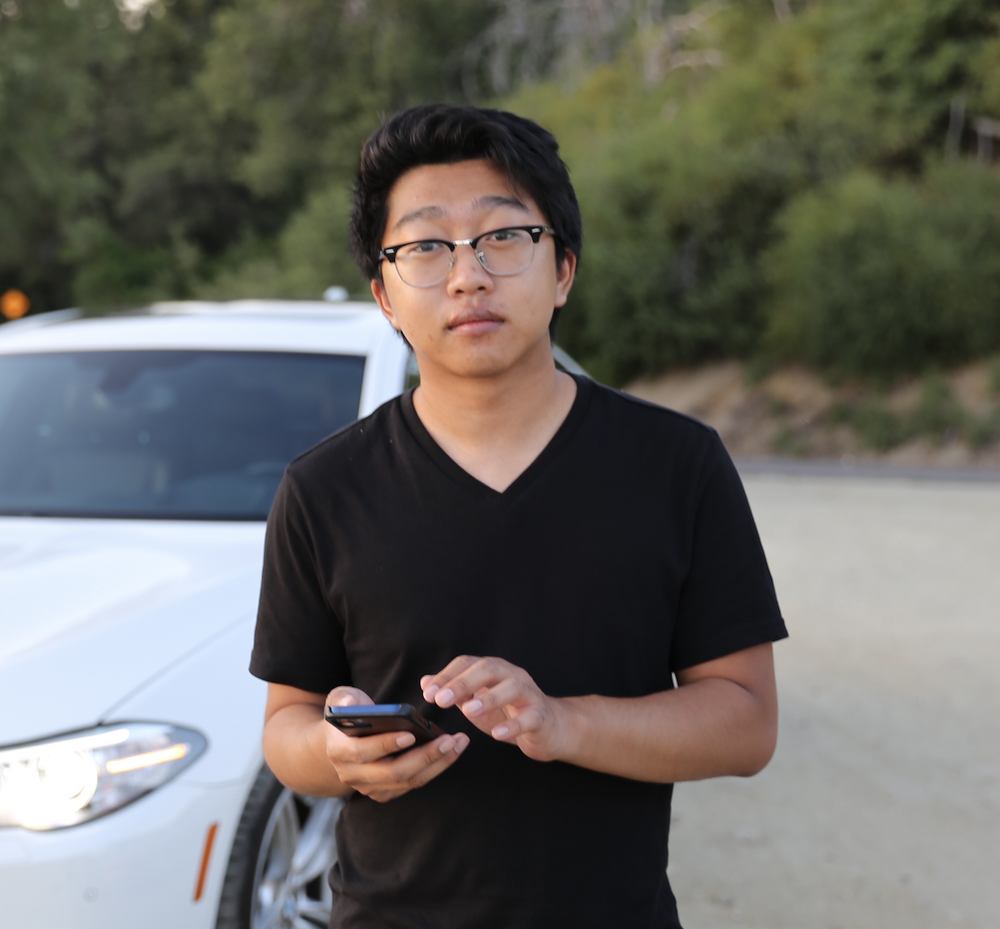

# **Who I Am**
Hello my name is _Matthew Chanthirat_.  

**About Me**  
- Age:21  
- Pronouns: He/Him/His  
- Warren College  
  
**Likes**  
1. Being with Family/Friends  
2. Food  
3. Cars and [my favorite brand](#my-ultimate-interest)  

**Dislikes**  
1. Loud unnecessary noises  
2. Being stuck in a line  

### Goals
[] Gain more experience as a programmer  
[] Graduate UCSD  
[] Find ways to save money  

## The Programming Experience
As a programmer, I am always looking to learn and get through challenges that I ~~may~~ will face. **Although programming is full of challenges and _not everything is easily accomplished_ , I see that as a growth.**   
Ultimately, new things can be an enjoyable experience because it is a new experience and getting the hang of it makes new learning experiences worthwhile.  
I feel it is very important to ***communicate*** with others in order to have clear expectations of one another. As it:  
>Would be awful to have merging issues.  
Such as, ff there was one 'git push' that caused things to go boom. 

## My Ultimate Interest
One things my friends know about me is when I talk about BMWs too much, and they are right.  
I am always on the [BMW](https://www.bmwusa.com/build-your-own.html#/series) website configuring a BMW I can't afford but dream of buying to replace my [BMW](myvehicle.md). 